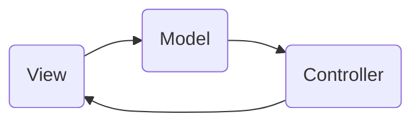

<h1 align="center">Xyloway</h1>

  
🌌 Xyloway is a space xylophone where each solar system planet represents a musical note.

 

## Tech Stack 👩🏻‍💻
- [Swift](https://developer.apple.com/swift/) based
- Design by [Behance](https://www.behance.net/diogo_jg68b5)
- Architecture
  - MVC Architecture

## Architecture 🏗

## Did you like this repository? :heart:
I'd much appreciate it, if you give it a :star:!  
You can also __[follow me](https://github.com/niinyade)__ on GitHub for my next projects! 🤗
